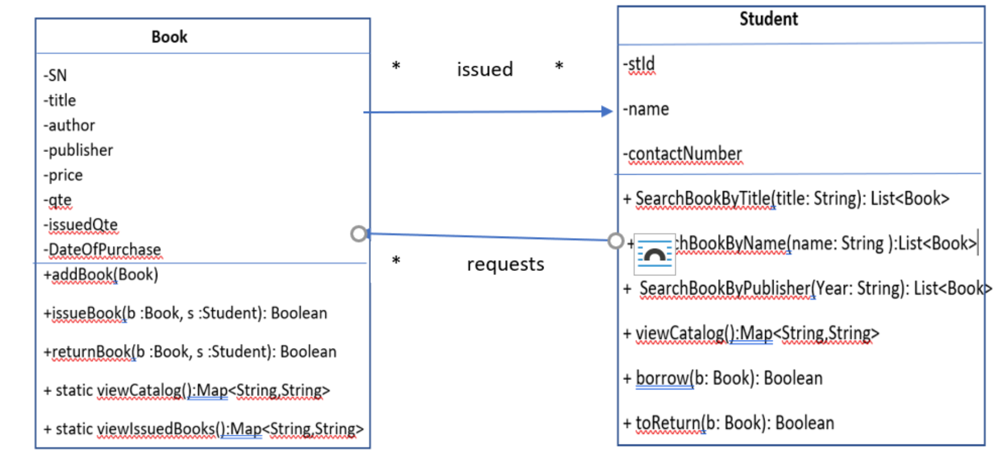

# Programming Patterns - Project

This template repository is the starter project for Programming Patterns Project. Written in Java, and tested with Gradle/JUnit.

### Question(s)

**Introduction**
A limited library management software is a small application where the librarian can add a book to the catalog, issue a book, return a book, and view the catalog and the list of issued books. To issue a book to a student, the librarian checks for the student roll number and also check the availability of the requested book. The librarian after checking out the book, updates the books table in the database. Books can be searched using the title, the author name, or the year of publishing.

**Learning Objectives**

- To build a monitoring system that can monitor and manage all library operations efficiently.
- To design a database to store the information about books and students.
- To develop a database client using Java and Java Database Connectivity API (JDBC).
- To apply some CRUD operations in a Java application using JDBC.
- To enter and preserve details of the various library items and keep a track on their returns.
- To develop international application by applying I18N and I10N concepts and related Java classes.
- To apply some of the design patterns seen in class and MVC architecture.
- To use Data structures and Stream processing (using Lambda expressions).

**Tools to be used**

1. Netbeans IDE.
2. SQLite for the database. You can also use MySQL if installed on your computer.

**Functional Requirements**
The system should provide different type of services based on the type of users [Student/Librarian].

1. Librarian
   1. Student
   2. Add a book to the catalog of books
   3. Issueabook
   4. Return a book
   5. View the catalog of books (issued and available books)
   6. View issued books with information about students who has borrowed the books
2. Student
   1. Search books by title
   2. Search books by author’s name
   3. Search by publisher
   4. View the catalogue of books (issued and available books)
   5. Borrow a book
   6. Return a book

**Design Requirements**

- A clear and precise interface should be designed for input and output. It should be a GUI application.
- Include all the supported class Libraries
- Must make use of at least two design patterns such as Factory Method pattern, Singleton, Adaptor,..
- The project should be designed using MVC architecture
- The application should be designed to support two languages, French and English. Make use of I18N Java classes, ResourceBundle and Locale classes. Feel free to add another language of your choice if you want to.
- Use data structures as seen in class that best represent your data.

**Database Creation**
You can create the following tables using MySQL, SQLiteStudio, SQLite Shell, or implement a method in your application to create and populate the two tables: Books and Students; as we did in class.

**Books table:**

SN: The book serial Number, TEXT, is the primary key.  
Title: is the book title and cannot be Null.
Author: is the author’s name and cannot be Null.  
Publisher: The book publisher and cannot be Null.  
Price: Unit price of purchase, not Null.  
Quantity: the number of copies.  
Issued: the quantity of issued copies, initially set to 0.  
addedDate: the date when the book was added to the table.

**Students table:**

StudentId: Student roll number, primary key.  
Name: Student name  
Contact: student contact number

**IssuedBooks table:**

id : an integer representing the primary key  
SN: The book serial number – is a foreign key
StId: Student id - is a foreign key  
StName: Student name  
StudentContact: Student contact number IssueDate: the date the book was issued.

**Implementation Details**

**1. UML of the two main classes**

**2. Methods specifications**

1. **addBook(Book):** The method creates a new entry in the Books table to add a new book to the catalog, sets “Issued” attribute to zero and addedDate to the current date.

2. **issueBook(b:Book,s:Student) and borrow(b:Book):**To issue a book to a student, student information should be verified first. If the book is available, the number of copies(“Quantity”) will be decreased by one and the number of Copies issued (“Issued”) will be increased by one. A new entry in “IssuedBooks” table is added. The two methods return true if the book was successfully issued.

3. **returnBook(b:Book, s:Student) and toReturn(b:Book):** To return a book, check first if an entry in the issuedBooks table about the book and the student exists that will verify the studentID. The number of copies “Quantity” will be increased by one and the number of copies issued will be decreased by one. The corresponding record in IssuedBooks table is deleted from the table. The two methods return true if the book was successfully returned.

4. **viewCatalog():** This method returns a map containing all data retrieved from the Books table. The key in the map is “SN”. All books should be sorted by “SN”. Use the appropriate formatting for the date and currency.

5. **viewIssuedBooks():** Retrieves all data from IssuedBooks table and returns them as a Map. The map is sorted by “SN”.

6. **The Search methods:** Retrieve only records from Books table that satisfy the criteria and return them as a list sorted by “SN”.

**Steps to follow**

1. Create and populate the database using JDBC within your application or in a separate application or using SQLiteStudio.
2. Design the user interface(GUI or Console).
3. Create the main classes.
4. Implement the MVC architecture.
5. Verify if CRUD operations implemented by the methods correctly update the database.
6. Consider Internationalization(choose two Localeo bjects).
7. Refactor the code to apply some design patterns.
8. Document your code using JavaDoc.
9. Create a Test class using JUnit to test the controller methods. All tests should pass.

**What to Submit**

1. Submit the Java project including all classes.
2. A snapshot of output demonstrating the functionality of the application whether correct or incorrect, complete, or incomplete.
3. The output should be clear and well-presented containing messages to reflect the code testing.
4. A snapshot showing which tests have passed.

**This is a group project of not more than two students.** It could also be implemented individually. If you choose to work in a team, then both students should work on the project and only one student should accept the project and create a repository. A demonstration may be required.

**Due date**

**Please, submit no later than April 30. You will have your project demonstration on May 1st & 2nd during your labs.**

The following criteria will be used to evaluate the project:

- Functionality (correct output, efficiency,..)
- Robustness (handling special cases, exceptions, and wrong input data..)
- Correct implementation of project specifications
- Correct use of Design patterns, I18N, MVC architecture, Lambda expressions,..and OOP concepts (Information hiding, polymorphism,..)
- Documentation of code
- Testing of code
- Presentation and completeness of output.

### Setup Command

`gradle clean`

### Run Command

`gradle test`
